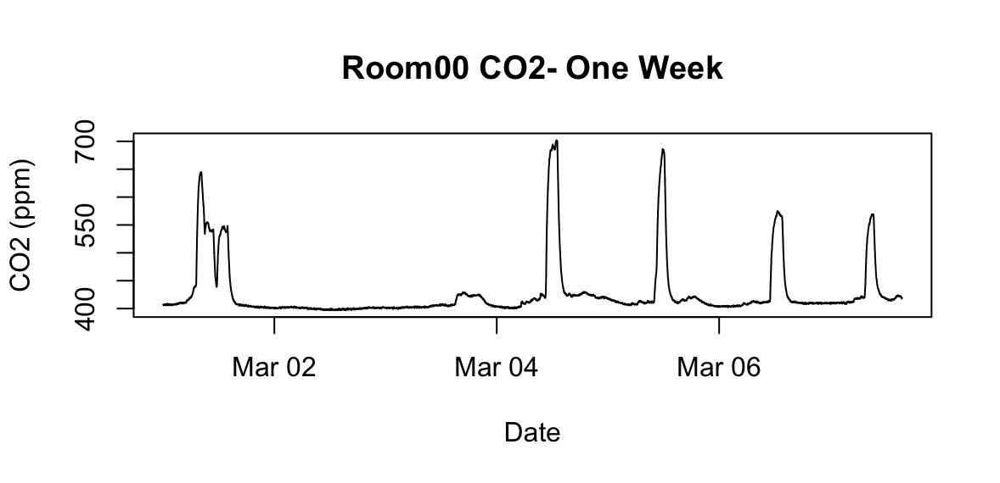
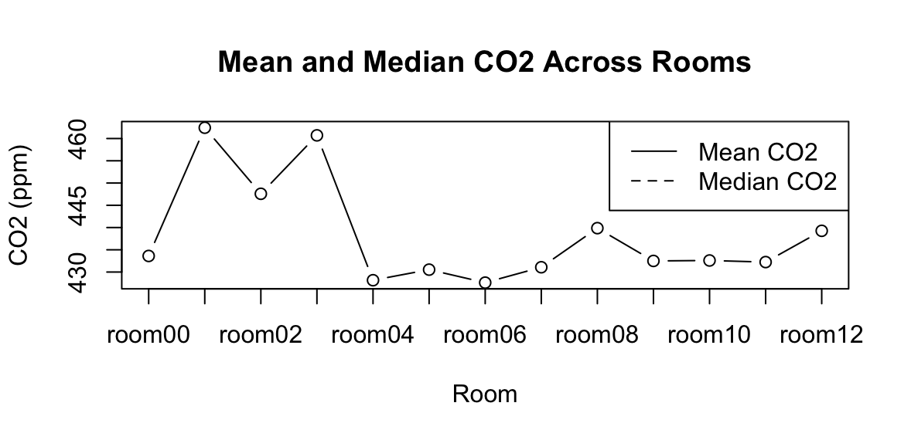
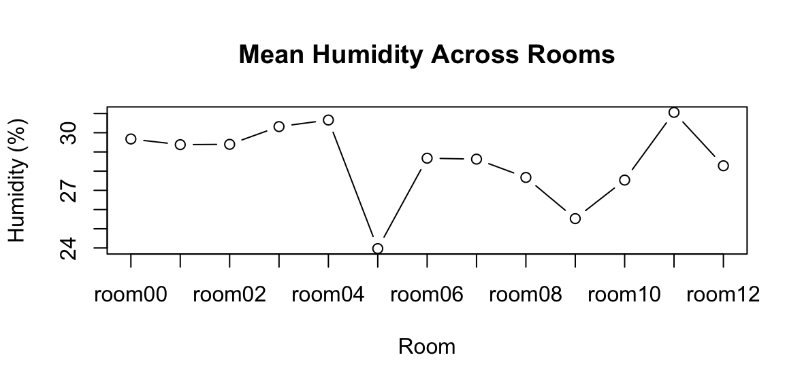

## IAQ Data science Project
Machine-learning system for forecasting short-term indoor air quality using environmental sensor data 

## Project Overview

This project investigates the development of data-driven system for short-term indoor air quality(IAQ) assessment using environmental sensor data.

The planned system combines two complementary components:
1. Short-term forecasting with CO2 concentration as the primary forecasting target, to estimate how indoor conditions are likely to evolve in the near future.
2. Anomaly detection, to identify observations or temporal behavior that deviate substantially from the expected sensor pattern.

The motivation for combining these approaches is that forecasting alone describes expected future behavior but may not adequately capture unexpected events. A hybrid approach could therefore support both proactive IAQ assessment and the detection of unusual conditions.

The project uses real-world environmental sensor measurements collected across multiple rooms. The current milestone focuses on establishing the data pipeline: understanding the sensor structure, assessing data quality, cleaning identified invalid measurements, examining temporal characteristics, and performing initial exploratory data analysis before model development.

The main variables currently considered are:

- CO2 concentration
- Temperature
- Relative humidity
- Timestamp information

PIR-based activity measurements are also available in the source dataset and will be investigated as a potential occupancy-related predictor during the modeling stage.

## Problem 

Indoor air quality is dynamic and can be affected by factors such as occupancy, ventilation, and changing environmental conditions. Conventional monitoring primarily describes current conditions, while earlier indication of deteriorating conditions could support more proactive indoor air quality management.

The central problem investigated in this project is therefore how environmental sensor time-series data can be used to provide useful information about upcoming changes in indoor air quality and unusual deviations from normal behavior. 

## Dataset

The initial analysis uses the VTT indoor air quality dataset. It contains environmental sensor measurements collected from multiple rooms during 2019.

The available sensor data include measurements such as CO2 concentration, temperature, relative humidity, pressure, and activity-related information. The raw dataset is organized into separate files corresponding to different rooms and sensor types.

During the initial exploration, the THP_CO2 files were selected as the primary data stream for the current analysis because they provide CO2, temperature, humidity, pressure, and timestamp information together. This allows the main environmental variables to be analyzed within the same time series.

The analysis currently covers 13 rooms (room00–room12). The raw observations are sampled approximately once per minute, although the exploratory analysis identified irregular sampling intervals and periods of missing measurements.

Dataset source: [VTT Indoor Air Quality Dataset](https://zenodo.org/records/4311286)

## Project Motivation and Related Work

The project direction was informed by literature on sensor-based indoor air quality analysis and machine-learning approaches for environmental monitoring. Previous research shows that environmental sensor measurements can support data-driven analysis of indoor conditions and motivates investigating temporal modeling of variables such as CO2, temperature, and humidity.

Based on this background, the planned system investigates a hybrid approach combining short-term CO2 forecasting with anomaly detection. The forecasting component is intended to estimate expected future behavior, while anomaly detection will be investigated for identifying observations or temporal patterns that deviate substantially from expected behavior.

At this stage, these components represent the planned modeling direction. Milestone 1 therefore concentrates on establishing and validating the data pipeline before forecasting and anomaly-detection models are developed.

Reference literature: [Machine-learning approaches for indoor air quality analysis](https://www.mdpi.com/1424-8220/26/9/2909)

## Method 

The work completed follows an exploratory data-processing pipeline:

1. Explore the raw dataset and sensor-file structure.
2. Compare sensor availability and measurements across rooms.
3. Select the THP_CO2 data stream for the initial analysis.
4. Convert Unix timestamps to datetime and examine the temporal structure.
5. Investigate sampling intervals, missing periods, and unusual measurements.
6. Clean identified invalid CO2 readings while preserving the remaining observations.
7. Perform initial time-series and cross-room exploratory data analysis.

The analysis is implemented in R

## Milestone 1: Initial Analysis and Findings
The first milestone focused on understanding the raw sensor data, establishing the initial preprocessing pipeline, and performing exploratory analysis before model development.

### Key Findings

- The selected THP_CO2 streams cover all 13 rooms and provide CO2, temperature, humidity, pressure, and timestamp measurements.
- Measurements generally follow an approximately one-minute sampling interval, although irregular and occasionally long temporal gaps are present.
- Repeated invalid CO2 readings of "43690" were identified in Room02, Room03, and Room12 and replaced with NA while preserving the remaining measurements.
- Initial time-series analysis shows clear short-term variation and repeated CO2 peaks.
- Cross-room analysis shows relatively similar median CO2 levels across rooms, while differences in mean, standard deviation, and maximum values indicate variation in the magnitude and variability of higher CO2 observations.

Detailed exploratory and cleaning procedures are available in the "scripts/" directory, while summary outputs are provided in "results/"

## Selected Visualizations
### Short-term CO2 behaviour

*One-week CO2 time series for Room00, showing repeated short-term variations and CO2 peaks.*

### CO2 comparison across rooms

*Mean and median CO2 concentrations across the 13 rooms.*

### Humidity comparison across rooms

*Mean relative humidity across the 13 rooms, showing differences in environmental conditions between rooms.*
 
## Summary Tables

Detailed numerical summaries: 

 [cross_room_summary.csv](results/cross_room_summary.csv) 
— descriptive statistics for CO2, temperature, and humidity across all 13 rooms.

 [time_summary.csv](results/time_summary.csv) 
 — timestamp coverage, median sampling intervals, maximum gaps, and counts of gaps longer than five minutes.

## How to Run
The analysis was performed in R.

1. Download or clone this repository.
2. Download the VTT indoor air quality dataset from the dataset source linked above.
3. Place the required raw data files in the data/ directory.
4. Open the project in RStudio and set the working directory to the root of the project.
5. Run the scripts in the following order:
   - scripts/01_data_exploration.R
   - scripts/02_Cleaning_and_EDA.R

The generated summary tables are stored in results/, while selected figures are stored in results/fig/.
The analysis was performed in R.

## Next Steps
Following the initial data exploration and preprocessing, the next stage will focus on preparing the time-series data for predictive modeling.

Planned work includes:

- investigating PIR-based activity information as a potential occupancy-related predictor;
- defining an appropriate short-term CO2 forecasting horizon;
- developing time-based features and lagged predictors;
- establishing a baseline forecasting model;
- evaluating forecasting performance using time-aware validation;
- investigating anomaly detection based on deviations from expected sensor behaviour.

The forecasting and anomaly-detection components will subsequently be considered together as part of the proposed hybrid IAQ assessment system.

